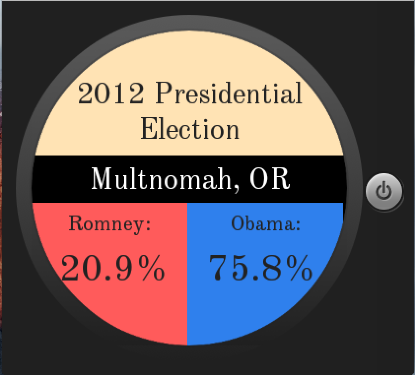

# PROG 02: Represent!

This project explores the idea of delivering House can Congress candidate information to the user in a fast and convenient manner. The application is on both a wearable watch and the phone. With only a few clicks, the user is able to either see candidates’ information of their current location, or any other location by zip code, or even a random location just for fun. 

## Author

Haojun Li ([haojun.li@berkeley.edu](mailto:haojun.li@berkeley.edu))

## Demo Video

See [DEMO] (https://youtu.be/L4Yd0gQ9iSo)

## Screenshots

Phone Interfaces:

Watch Interfaces:

## Notes
I actually changed the icon because the old icon is actually Sunlight Fundation's
Congress iOS app. I don't wanna be sued. Instead, I used an icon by CC license.
[Congress by Martha Ormiston from the Noun Project](https://thenounproject.com/term/congress/12741/)

Also, I did not push the API keys to the repo. So if you recompile the code and try to run it it wouldn't work because the API keys file is not found.
